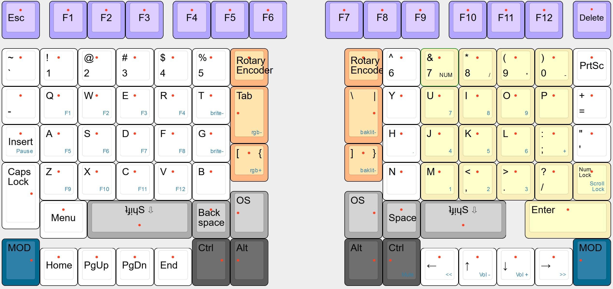

# ComfyThumbs

A column-staggered keyboard inspired by comfortable and efficient thumb use and keycap compatibility.

### The Default Keymap
<h5><b>Comfy Thumbs Rev 1</b></h5>

[Check out the Gist on Keyboard Layout Editor](http://www.keyboard-layout-editor.com/#/gists/f06e432c5aefd1113cb8e74766a2c700)

### High Keycap Compatibility

Comfy Thumbs has the highest keycap compatibility of any column-staggered board. Space and Backspace are the only keys that are not traditionally-sized. That means you won't need to buy/use different keycaps for `Right Shift`, `Left Shift`, `Enter`, `Tab`, `\ `, `Command`, `Ctrl`, `Alt`, `OS`, and `Application` keys. Just chose any Standard ANSI keycap set (99% of keycap sets), and you're good to go!. 

### Use your thumbs without hurting them

|Thumb Cluster Style|# of keys|Avg. reach from Home Position|
|---|---|---|
|ComfyThumbs|5|1u
|Manuform/Dactyl-Manuform|6|3.5u
|Maltron/Dacyl/Kenesis/Ergodox|6-8|4.5u

Unlike other large thumb cluster designs that waste valuable space by pushing the cluster away from resting thumb position or building the cluster on a convex plane, all thumb keys are within 1u radius of resting position. The thumbs naturally rest on either `Space` or `Backspace`, with `Shift`, `Ctrl`, `Alt` and `OS` nearby. There are two thumb rows; `Space`, `Backspace`, and both `Shift` keys have a higher profile on the upper thumb row to distinguish thumb location by feel.

### Comfy Thumbs = Comfy Pinkies
Your pinkies have been doing way more work than they should. That's why modifiers have moved to the thumb cluster. Adding to that, the index fingers have a new inner column for `Tab`, `\ `, `-`, `=`,  `[` and `]`.

Keyboard Maintainer: [GalacticWafer](https://github.com/GalacticWafer)  

### Compiling the Firmware

See the [build environment setup](Todo) and the [make instructions](Todo) for more information. Brand new to ZMK? Start with our [Complete Newbs Guide](Todo).

